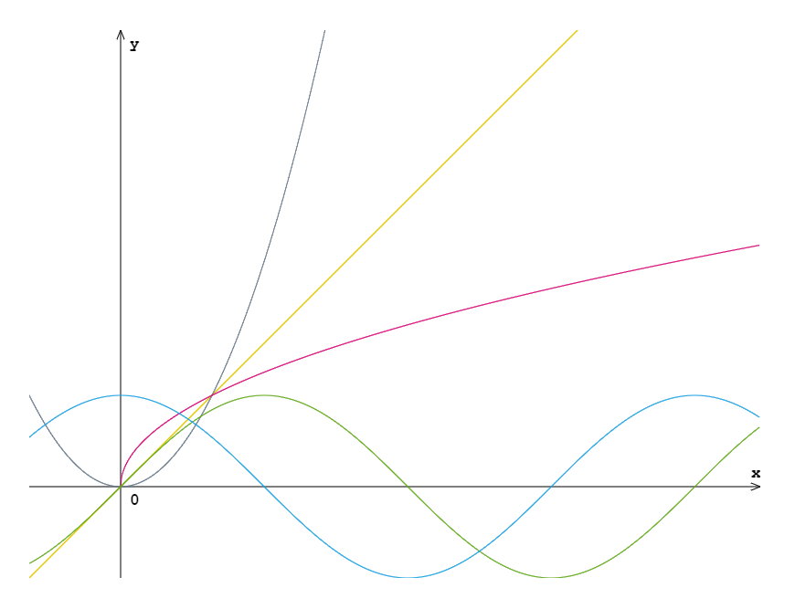

# mc.js

 > mc.js (mathematical canvas) 是一个用来绘制简单的数学函数图像的 js 库

 ---

## 前言

本人在做毕业设计的时候因为需要画一些函数图像，在网上找过一些已经很成熟的库（如 D3.js），但是不是特别满意（要么是不方便画函数图像，要么是学习成本略高，有点杀鸡用牛刀的感觉），于是自己花了点时间来造了这么一个轮子。  
`mc.js` 把坐标转换以及函数图像缩放封装起来，使得在进行项目开发的时候可以直接用数学函数的思维去绘图，而不需要再考虑数学坐标与 canvas 坐标之间的转换。

## 适用范围

 - 可以绘制简单的单定义域的数学函数图像，如初等函数(`y = x`、`y = x^2`、`y = x^(1/2)`)、三角函数 `sin`、`cos`、`tan` 等；  
 - 暂不支持方程式的图像，如椭圆方程、双曲线等

## 使用方法

先在页面建立一个`<canvas></canvas>`，然后引入 `mc.js`

```html
<!DOCTYPE html>
<html>
    <head>
        <meta charset="UTF-8"/>
        <title>mc.js Demo</title>
    </head>
    <body>
        <canvas id="mc" width="800" height="600"></canvas>
    </body>
    <script src="mc.js"></script>
</html>
```

实例化一个 mc 对象

```js
/**
 *  有 3 个必选参数和 2 个可选参数
 *  mc(canvas, X, Y, offsetX = null, offsetY = null)
 *    第一个参数 canvas 是 <canvas>，可通过 document.getElementById 等方法取得
 *    第二、第三个参数是指坐标的长度
 *    第四、第五个参数是指原点的偏移量（以左下角为参考点），如果省略即表示原点处于 <canvas> 的正中间
 *
 *  下面是实例化一个 X 轴为 8 个单位长度、范围是 -1~7，
 *                  Y 轴为 6 个单位长度、范围是 -1~5 的直角坐标系对象
 */
var myMC = new mc(document.getElementById("mc"), 8, 6, 1, 1);
```

接着使用 `drawCoordinate()` 把坐标系画出来

```js
myMC.drawCoordinate();
```

然后就可以使用 `drawFuncGraph()` 方法进行图像绘制了。  
该方法有 3 个必选参数和 1 个可选参数：`(func, startX, endX, color = "#FF0000")`，其中

 > `func` 是要绘制图像的函数，需为 `func(x){ return y; }` 这种形式  
 > `startX` 是定义域的左端点  
 > `endX` 同理是定义域的右端点
 > `color` 是函数图像的颜色

绘制 `y = x` 的图像

```js
myMC.drawFuncGraph(func0, -1, 7, "#E3C800");

function func0(x) {
    return x;
}
```

绘制 `y = x^2` 的图像

```js
myMC.drawFuncGraph(func1, -1, 7, "#647687");

function func1(x) {
    return x ** 2;
}
```

绘制 `y = x^(1/2)`的图像

```js
myMC.drawFuncGraph(Math.sqrt, 0, 7, "#D80073");
```

绘制 `sin` 的图像

```js
myMC.drawFuncGraph(Math.sin, -1, 7, "#60A917");
```

绘制 `cos` 的图像

```js
myMC.drawFuncGraph(Math.cos, -1, 7, "#1BA1E2");
```

绘制结果如下图：



## TODO

 - 增加坐标网格
 - 增加刻度
 - 增加绘制“点”功能
 - 把箭头画得更好看
 - ...